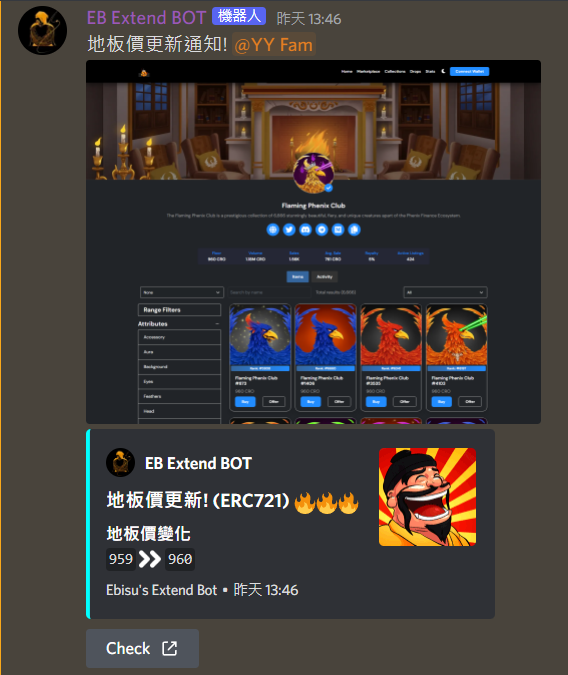
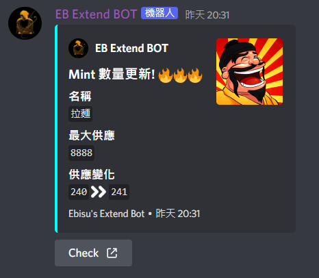

# Eb Supporter
  

> This bot helps people to get more infomations automatically on Ebisu's bay (A NFT market on Cronos).

 

## How to use
- ##### [Set up](doc/how-to-setup.md)
- ##### [Commands](doc/commands.md)

 

## Demonstration
> The main tasks are to automatically track floor price changes and mint amount changes.

 

 

> More functions can be found in [Commands](doc/commands.md).

## Reference

- ##### [Discord Developer Portal](https://discord.com/developers/docs/getting-started)
- ##### [Pycord Documents](https://docs.pycord.dev/en/master/)
- ##### [Pycord Guild](https://guide.pycord.dev/introduction)
- ##### [Pyppeteer](https://github.com/pyppeteer/pyppeteer)
- ##### [CoinMarketCap API Document](https://coinmarketcap.com/api/documentation/v1/)

 

## License
[All Rights Reserved](https://github.com/0xmimiQ/eb_supporter/blob/main/LICENSE)
