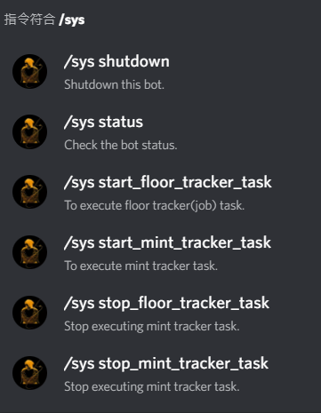
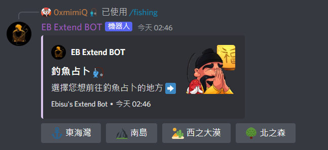
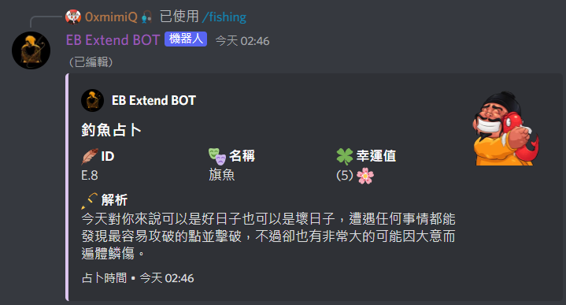
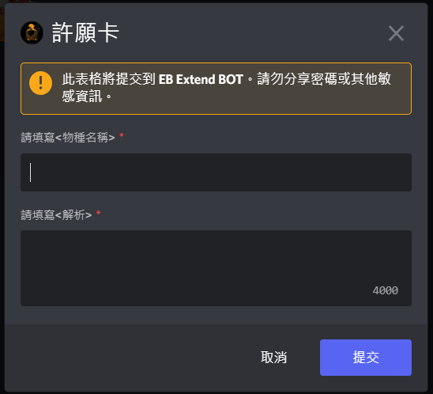

## Commands
> Here are all commands on this bot.\
Some commands are tagged as owner, which means that the user must be the bot owner to use them.

<br />

## Command group: set
```
/set floor_tracker url:
``` 
Set up automatic tracking of floor prices for EB collections.

<br />

 
```
/set mint_tracker address: token_name: total_supply:
```
Set up automatic tracking of mint changes for Cronos tokens.

<br />

## Command group: delete
```
/delete floor_tracker url:
``` 
To delete an EB Collection Floor Price Tracker, you must be the creator of the tracker.

<br />

 
```
/delete mint_tracker address:
```
To delete an Mint Tracker.

<br />

## Command group: list
```
/list all_jobs
``` 
List all created Floor Price trackers.

<br />

```
/list jobs user:
```
List a specific user's all created Floor Price trackers.

<br />

```
/list all_mint_trackers 
``` 
List all created Mint trackers.

<br />

## Command group: convert
```
/convert to_usd cro:
``` 
Convert the price from CRO to USD.

<br />

```
/convert to_cro usd:
```
Convert the price from USD to CRO.

<br />

## Command group: sys
> Here are system commands which show below in image.\
It's easy to know what those functions really do.

 

<br />



<br />

## Commands (Funny)
> Here are some funny functions.

```
/choose options:
``` 
Choose one of the options given by the user, separated by `,` or `space`.

<br />

```
/fishing
``` 
Divination by fishing.

<br />



<br />



<br />

```
/wish
``` 
Make a wish to Ebisu to increase the number of species. (It will generate a json file named by uuid4 according to user's input, and the bot owner can decide whether to add it to DB or not.)

<br />



<br />

