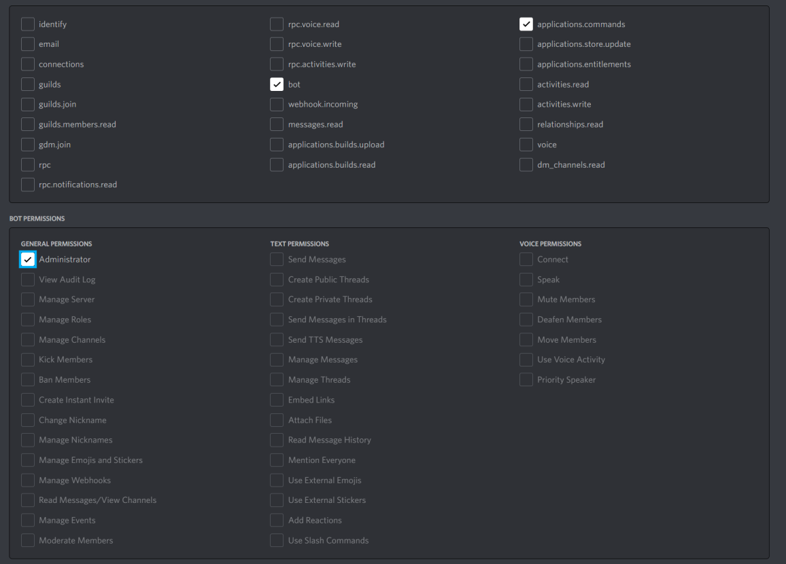
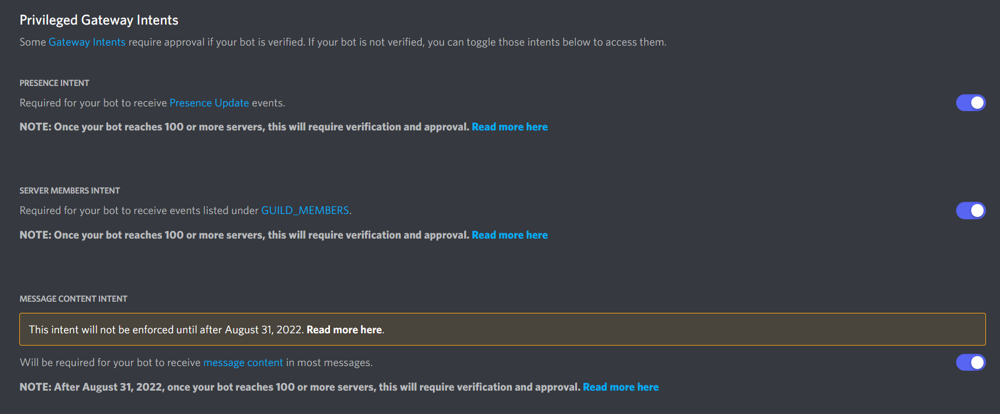

## How to setup
> Get Discord bot token with some settings first.
1. Go https://discord.com/developers/applications to get your bot token.
2. Make the following settings. (Permissions & Intents)



<br />



<br />

> Setting the local bot configs file.
1. Copy `backup_settings.json` from `backup/src/` to `/src`, and rename it to `settings.json`
2. Paste your token, api key, channels id in this file.
``` json
{
    "BOT_TOKEN": "Your Token",
    "OWNER_ID": 0,
    "CRONOSCAN_API_KEY": "Your Key",
    "COINMARKETCAP_API_KEY": "Your Key",
    "SYSTEM_LOG_CHANNEL_ID": 0,
    "FLOOR_TRACKER_CHANNEL_ID": 0,
    "MINT_TRACKER_CHANNEL_ID": 0,
    "":"..."
}
```

<br />

> Install all required package.
``` sh
pip install -r requirements.txt
```

<br />

> Import all `*.sql` file from `backup/db/` into your Mysql database.


<br />
If you want to use a cloud database, you will need to change the following settings in `connect` function for `SqlDB` object in `work_unit` module to the ones you want.
``` python
self.__db = pymysql.connect( host = 'localhost',
                             port = 3306,
                             user = 'root', 
                             passwd = passwd, 
                             db = 'ebisu_tracker', 
                             charset = 'utf8' )
return ( True, '' )
```

<br />

> Now, You can run this bot.
``` sh
python run.py
```